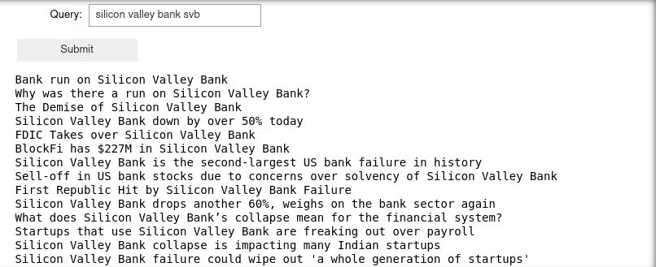

# Creating a recommender system for articles

In this notebook, we will walk through how to create a simple algorithm that will recommend the top N posts based on our interests. The steps required to do this look like the following:

1. Fetch N posts from the HN API and aggregate into a list in-memory
2. Cleanse the data by vectorizing the list and removing stop words
3. Create a matrix that follows the structure of TF-IDF (term frequency inverse document frequency)
4. From here, we can vectorize our query and compute the cosine similarity of our input against our model. We will sort and rank the most similar titles to find links of interest. 

---

## Simple UI

## Setup

1. Create a virtual environment

`virtualenv ml`

2. Install requirements

`pip install -r requirements.txt`

3. Run the notebook

`jupyter notebook`

Run each cell in serial order, the last cell will be the UI. The first cell might take a bit to pull all the results from the API (not super optimized.)

We only need to run that cell once to cache the results so future queries are instantaneous.

